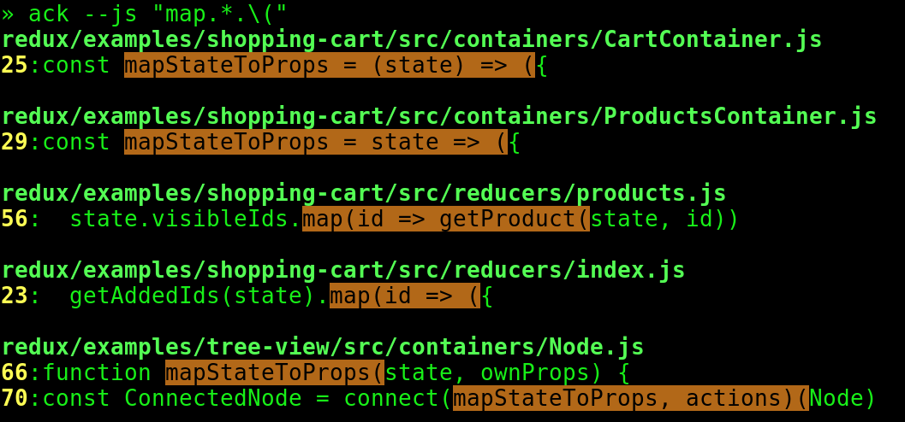

In my experience being efficient at navigating and searching through code will help in refactoring, learning a large new codebase and debugging some control path.

In this post I'll run through some common search queries using the unix commands [find](https://linux.die.net/man/1/find) and [grep](https://linux.die.net/man/1/grep) as well as a more programmer specific utility [ack](https://beyondgrep.com).

`find` has been around since the 5th edition of unix in 1974 and `grep` in the 4th edition 1973. You will find these tools in any modern *unix-like*, *linux* system. Essentially `find` can be used to search for files under a directory tree, recursively. `grep` can be used to return matches from patterns in the data sets `find` will pipe through.

`ack` is often described as a tool "*like grep, optimized for programmers*". In comparison to grep it has a highly more opinionated default configuration, tailored for programming projects.

Lets go through some common queries:

### Find all files by extension

Lets find all javascript files under the current working folder:

```shell
find -name "*.js"
ack -f --js
```

`-name` any unix pattern for the base of file name.

`-f` will only output the files names.

`--js` is one of the many inbuilt file type sets for searching within `*.js` javascript files.

### Find a file by filename

This first query shows one difference between `ack` and `find`. If you wanted to find filenames with the word 'compiler' in them you can easily modify the regex of find like so:

```shell
find -name "*compiler*.js"
```
 
 However `ack` is more suited to search the contents of the files. You could think of `ack` as a search tool with `grep` infact the main domain of the project is [beyondgrep.com](https://beyondgrep.com/). With this in mind, you could simply pipe `ack` with the filelist from before into `ack` which would give you something similar to the result of `find`, for example:
 
```shell
ack -f --js | ack 'compiler'
```

### Find a pattern in files

The next most common search would be to find a particular pattern within a folder of files recursively. For this example we are going to search for a javascript `function mapTransform`. This is the kind of scenario where `ack` has defaults that make this dead simple.

```shell
ack --js "function mapTransform"
```

In comparison `grep` and `find` are quite capable, however you really need to know your way around the options.

```shell
find . -name '*.js' -exec grep -i 'function mapTransform' {} \; -print
```

`-exec` will execute a shell command, the curly `{}` characters are replaced by the current file and `/;` escape and end the arguments for the command.

`-print` will print the full file name in the standard output.

### ack default filters

After trying a few of these queries out yourself you might start to think `ack` is faster, actually be careful on this assumption. `ack` was designed for programmers, so it has made assumptions about what the programmer wants to search and excludes what it does'nt. One of the first lines on the website gives it away, "It's fast because it only searches the stuff it makes sense to search.". Some interesting examples have been done on codeseekah with [time comparisons ack vs grep](https://codeseekah.com/2012/03/11/ack-grep-vs-grep).

For example the `.git` folder is excluded and in `npm` projects the dependencies `node_modules` folder is excluded. To avoid this you can always use the `--noignore-dir` option. For example if you are working in an `npm` javascript project you can include also searching your dependencies with:

```shell
ack -f --js --noignore-dir=node_modules
```

### ack stdout

One other great part of using `ack` is the functional coloured output it displays for things like character matches and line numbers. It also offers the ability to tweak and theme what you see beyond the default output in it's options. Here is just an with the default stdout:



If you want to see how it can help problem solving, checkout this ascii-cinema for [using ack and regex to convert unstructured NASA GISS temperature data to CSV](https://asciinema.org/a/100135),

### Last words

This is only an intro into what you can do with `ack`, `find` and `grep`. Believe me it's just the start of a journey into this kind of tooling. Here are some links that I've found useful:

* [ack for css developers](https://csswizardry.com/2017/01/ack-for-css-developers)
* [example ack config file](https://gist.github.com/mishin/4bb996dbd4a1b8f5b9b7d0f156c6b0cd)
* [more tools from beyondgrep](https://beyondgrep.com/more-tools)
