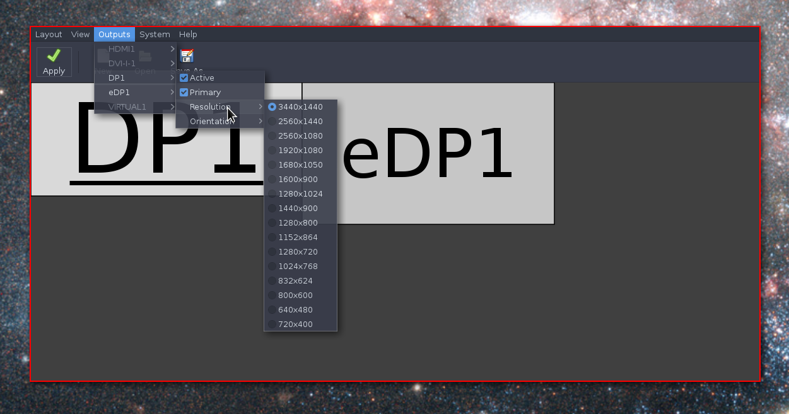

I have been enjoying the simplicity of the i3 window manager on linux. It's been an awakening to see how productive you can be with such a lightweight solution.
 
 With i3 is being so minimalist, there maybe features you expect that are not pre-configured. So you may need to figure some of it out yourself. I wanted to be able to move between a work dual monitor setup, the train and my monitor at home. i3 does not provide the same monitor management solutions as other linux window managers.

In this post I'll show one approach to managing, arranging and switching between multiple displays using `xrandr` and a little i3 configuration. So next time you want to plug into a projector or move to a new workstation you'll know how to get setup.

### xrandr is here to help

> xrandr is an official configuration utility to the RandR X Window System extension. It can be used to set the size, orientation or reflection of the outputs for a screen.

xrandr is configured through the command line and gives you control of your system's displays. For example, it is quite useful to use `xrandr` to list the displays currently connected and show their available resolutions eg:

```shell
> xrandr
Screen 0: minimum 8 x 8, current 3440 x 1440, maximum 32767 x 32767
eDP1 connected (normal left inverted right x axis y axis)
   3200x1800     59.98 +
   2880x1620     60.00
   2560x1440     60.00
   2048x1536     60.00
...
DP1 connected 3440x1440+0+0 (normal left inverted right x axis y axis) 797mm x 333mm
   3440x1440     59.97*+  49.99    29.99
   2560x1440     59.95
   2560x1080     60.00
   1920x1080     60.00    59.94
...
HDMI1 disconnected (normal left inverted right x axis y axis)
VIRTUAL1 disconnected (normal left inverted right x axis y axis)
```

You can use this information with other commands. Once you know the display ids like in this example `eDP1` or `DP1` you can use the xrandr command to do things like the position, rotate and adjust the gamma.

Here we can tell a display from the previous list to display at a specific resolution and position.

```shell
xrandr \
--output eDP1 \
--mode 3200x1800 \
--pos 0x0 \
--rotate normal
```

To turn a display off:

```shell
xrandr --output DP1 --off
```

Although you can manage the arrangement and positioning of your displays with direct xrandr commands, I think a visual representation of the displays position makes things much easier. There are a few guis that do exactly this, I'll now be showing off [arandr](https://christian.amsuess.com/tools/arandr/). It is available on must Debian Ubuntu distros through:

```shell
sudo apt-get install arandr
```

When first launching arandr you should see a representation of your displays, similar to other window managers:


You can now drag and drop the arrangement of the screens, rotate and set their resolutions:



`arandr` is an especially great gui for xrandr given that it can generate a bash script from the configuration you do. This bash script will contain regular `xrandr` commands for you to use whenever you need.

To demonstrate this, just click the `Save As` button to generate the bash script. So it may make sense to name these configurations as something like `home-displays.sh`, `work-displays.sh`. A suggested location would be something like `~/.screenlaylout/xrandr-config.sh`.

### Switching display modes in i3

Now to solve my use case of moving in-between, home, work and just the laptop display. To do this we'll use [binding modes][i3-binding-modes]. It is a simple way to implement a prompt like interface in i3. 

The prompts can perform actions that allow i3 key modifiers in a new context. It is the what is used in the default config that lets you resize focused window tiles with `$mod+r` for resize.

So for switching in-between the xrandr configurations, you can use a binding mode to run the `arandr` generated bash scripts, here is how I did mine:

```shell
set $displayMode "Set display mode [w]ork [l]aptop [h]ome"
bindsym $mod+x mode $displayMode
mode $displayMode {
    bindsym w exec "\
                ~/.config/i3/scripts/work-displays.sh && \
                mode "default"
    bindsym h exec "\
                ~/.config/i3/scripts/home-display.sh && \
                mode "default"
    bindsym l exec "\
                ~/.config/i3/scripts/laptop-display.sh && \
                mode "default"

    bindsym Return mode "default"
    bindsym Escape mode "default"
}
```

This mode when enabled acts like this:


So with tools like arandr and the i3 mode configuration it's easy to have a usable solution quickly. Knowing about i3 [binding modes][i3-binding-modes], I am sure you can think of other use cases.

### Systray on multiple Displays

On my first install of i3 the system tray was missing, i3 supports the system tray in i3bar natively. I needed to configure the i3 [tray_output][tray_output] manually. You can even use this to disable the tray.

`tray_output` is can be used in the i3bar `bar` configuration. Eg:

```shell
bar {
    status_command i3status
    tray_output primary
    position top
}
```

The value of `tray_output` is the display id to display the tray on. The default i3 configuration gives you defaults to primary, however my system had no primary set. xrandr can help you keep with the primary convention by setting it manually:

```shell
>xrandr --listmonitors

Monitors: 1
 0: +*DP1 3440/797x1440/333+0+0  DP1
```

With your monitor identified, assign it as the primary display.

```shell
xrandr --output DP1 --primary
```

You can now add this working config to your screenlayout xrandr scripts.

On most distributions you should immediately see it work with a wifi icon. I don't usually have need for a systray however some applications seem to require one, like [silentcast][silentcast].

Enjoy having more control over your displays :)

To see what else you can do try with xrandr try out the `xrandr --help` or see some great docs on the [arch wiki][arch-wiki-xrandr].

[tray_output]: https://i3wm.org/docs/userguide.html#_tray_output
[silentcast]: https://github.com/colinkeenan/silentcast/
[i3-binding-modes]: https://i3wm.org/docs/userguide.html#binding_modes
[arch-wiki-xrandr]: https://wiki.archlinux.org/index.php/xrandr
